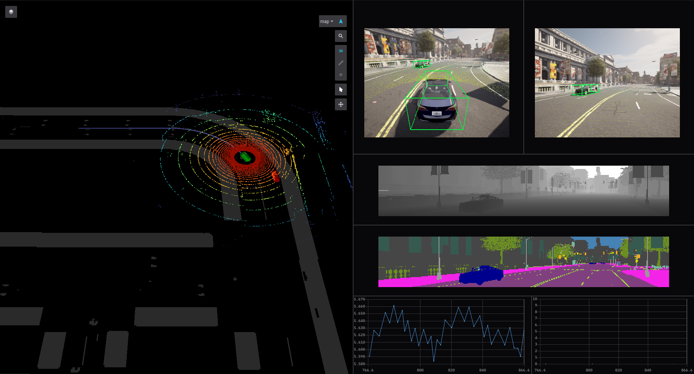

# ROS/ROS2 bridge for CARLA simulator
 This ROS package is a bridge that enables two-way communication between ROS and CARLA. The information from the CARLA server is translated to ROS topics. In the same way, the messages sent between nodes in ROS get translated to commands to be applied in CARLA. We use [FoxGlove](https://foxglove.dev/) to visualize simulation data.


**This version requires CARLA 0.9.12**

## Features
- Provide Sensor Data (Lidar, Cameras (depth, segmentation, rgb), GNSS, IMU)
- Provide bboxes of vehicles.
- Draw lidar points on RGB camera.

## Getting started

### Docker setup
- Clone the ros-bridge repo with carla_msgs submodule.
```bash
 git clone --recurse-submodules -b ros2_test https://github.com/makaveli10/ros-bridge.git
 cd ros-bridge/
```

- Build docker image
```bash
 docker build -t carlafox . --build-arg ROS_DISTRO=foxy
```

### Quick Start
- Start the Carla Server
```bash
 ./CarlaUE4.sh -RenderOffScreen -nosound 
```

- Start docker container with Foxglove web interface
```bash
 docker run -it -d -p 9090:9090 -p 8080:8080 carlafox 
```

- Create another docker bash terminal, setup environment
```bash
 docker exec -it "container_id" bash
 cd /opt/carla-ros-bridge
 source ./install/setup.bash
```

- Run Ego Vehicle example. 
```bash
 ros2 launch carla_ros_bridge carla_ros_bridge_with_example_ego_vehicle.launch.py
```

- Or just run the ros bridge and spawn actors from another client. This runs the ros_bridge in sync mode i.e. all sensor data is in sync and ros_bridge ```tick()``` the world. The client used for spawning actors/sensors shall not ```tick()``` but ```wait_for_tick()``` from ros_bridge.
```bash
 ros2 launch carla_ros_bridge carla_ros_bridge.launch.py
```

- To run in passive mode where rosbridge won't be ticking but only publishing data and the client used to spawn actors shall ```tick()```.
```bash
 ros2 launch carla_ros_bridge carla_ros_bridge.launch.py passive:=True
```
*NOTE*: Another client must ```tick()``` otherwise carla-ros-bridge will freeze.

- Access FoxGlove here -> http://localhost:8080/?ds=rosbridge-websocket&ds.url=ws%3A%2F%2Flocalhost%3A9090&layoutURL=foxglove_layout.json

*NOTE*: Use Chrome Browser.



