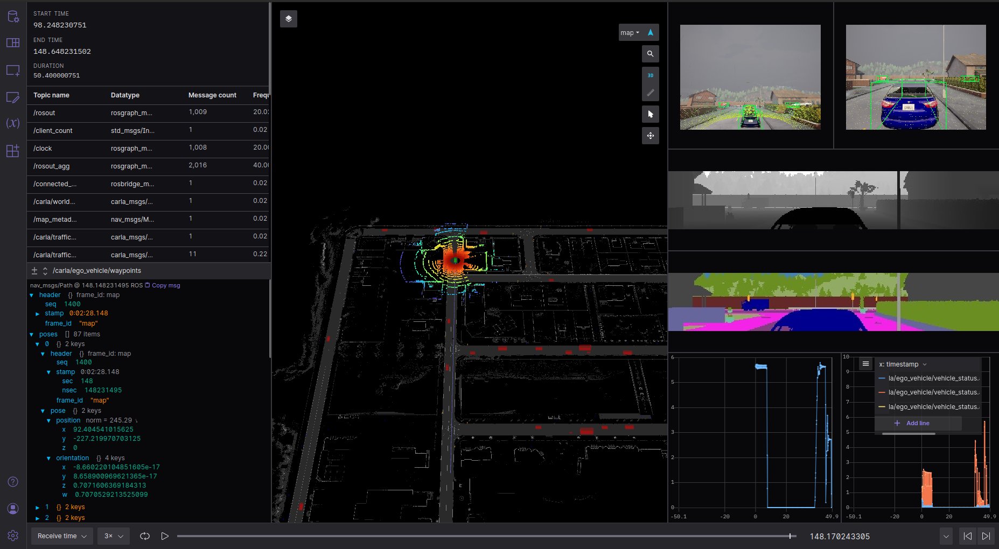

The ROS bridge package is a bridge that enables two-way communication between ROS and CARLA. The information from the CARLA server is translated to ROS topics and thus can be visualized in various visualization tools e.g. [FoxGlove Studio](https://github.com/foxglove/studio). This bridge can be used to setup and monitor a CARLA environment for simulated dataset generation for perception systems, image synthesis, and automatic ground truth data generation or testing the trained models.




# What is ROS?
The Robot Operating System (ROS) is a set of software libraries and tools that help you build robot applications. Most Robots are made up of actuators, sensors, and control systems. ROS provides a standard way to visualize and connect all your sensors (cameras, distance sensors, analog to digital converters, IMU) together with the control software that makes the decisions.

ROS helps developers quickly build these components and easily connect them using ROS tools called topics and messages. These messages can be published on ROS topics and shared with visualization tools. Also, ROS can be used with simulated robots, which makes training and testing easier, faster, and more effective.

# ROS with CARLA
CARLA is an open-source simulator for autonomous driving research. The simulator provides API to spawn vehicles into the CARLA world, which can be controlled by custom models or via autopilot. Moreover, it comes with various maps of different environments like countryside roads or urban areas. It also provides methods to change weather conditions like time of day, precipitation, etc.

## ROS bridge Sensors & our additions
CARLA simulator provides methods to attach multiple sensors to CARLA vehicles(actors) like RGB cameras, semantic segmentation camera, depth camera, IMU, LiDAR, semantic LiDAR. It also allows simulating custom traffic scenarios.

This repository is a fork of carla-simulator/ros-bridge which already had various sensor data converted to ROS messages, some of which we had to modify as well to fit our usecases:

- RGB Camera - [sensor_msgs/CompressedImage](https://docs.ros.org/en/api/sensor_msgs/html/msg/CompressedImage.html)
- Depth Camera - [sensor_msgs/CompressedImage](https://docs.ros.org/en/api/sensor_msgs/html/msg/CompressedImage.html)
- Semantic Segmentation Camera - [sensor_msgs/CompressedImage](https://docs.ros.org/en/api/sensor_msgs/html/msg/CompressedImage.html)
- Vehicle Position - [geometry_msgs/PoseStamped](http://docs.ros.org/en/noetic/api/geometry_msgs/html/msg/PoseStamped.html), [sensor_msgs/NavSatFix](https://docs.ros.org/en/api/sensor_msgs/html/msg/NavSatFix.html), [tf2_msgs/TFMessage](http://docs.ros.org/en/noetic/api/tf2_msgs/html/msg/TFMessage.html)
- Velocity and Acceleration - [carla_msgs/CarlaEgoVehicleStatus](https://github.com/carla-simulator/ros-carla-msgs/blob/master/msg/CarlaEgoVehicleStatus.msg)

Apart from that, we added some new features and updates:
- Converted all the camera message types from ```sensor_msgs/Image``` to ```sensor_msgs/CompressedImage```.
- Added support for ```ros map_server``` for ROS1 and ```nav2_map_server map_server``` for ROS2 to convert map images to ```nav_msgs/OccupancyGrid``` so that the map is able to be displayed on 3D panel in visualization tool like FoxGlove Studio or WebViz.
- Added PCL maps on top of ```ROS1/ROS2 map_server``` to display more detailed maps on the 3D panel of your favorite visualization tool.
- Added support to publish ego vehicle traversed path as ```nav_msgs/Path``` which itself is a list of waypoints ```geometry_msgs/PoseStamped```.
- Added a separate ROS topic that publishes RGB camera images with 3D Bounding boxes and LiDAR points overlaid.

# How to use
Autonomous vehicles require large-scale development and testing in a wide range of scenarios before they can be deployed. Moreover, huge amounts of data are required to train models for planning and perception, which can be costly and time consuming. To solve the problem, simulated datasets from the CARLA simulator can be a great solution but still could be time-consuming and might require diligence to validate the data gathering process.

## CarlaFox
We implemented [Carlafox](https://github.com/collabora/carlafox) - a web-based CARLA visualizer that can combine a number of ROS topics message streams, including support for text and custom shapes in one single visualization to solve the problem of monitoring the data gathering process or testing your perception/planning models.

Carlafox eradicates the hassle of using the ros-bridge with CARLA and adds FoxGlove Visualization on top of that. Instead of following intricate steps like running CARLA server, starting the ros-bridge, and finally, starting FoxGlove or any other visualization tool. Carlafox pulls everything together and makes it a lot easier to get started.

## ROS Bridge & CARLA
Besides, you can also use the ros-bridge without Carlafox. 
- Clone the ros-bridge repo with carla_msgs submodule.
```bash
 git clone --recurse-submodules https://github.com/makaveli10/ros-bridge.git
 cd ros-bridge/
```

- Build docker image with ROS1/ROS2
```bash
 docker build -t carlafox . --build-arg ROS_DISTRO=noetic ROS_DISTRO=foxy
```

- Start the CARLA server
```bash
 ./CarlaUE4.sh -RenderOffScreen -nosound 
```

- Start carla-ros docker container
```bash
 docker run -it -d -p 9090:9090 carlafox
```

- Setup ROS environment
```bash
 docker exec -it "container_id" bash
 cd /opt/carla-ros-bridge
 source ./devel/setup.bash
```

- Run Ego Vehicle example
```bash
 roslaunch carla_ros_bridge carla_ros_bridge_with_example_ego_vehicle.launch
```

- Or just run the ros bridge and spawn actors from another client. This runs the ros_bridge in sync mode i.e. all sensor data is in sync and ros_bridge ```tick()``` the world. The client used for spawning actors/sensors shall not ```tick()``` but ```wait_for_tick()``` from ros_bridge.
```bash
 roslaunch carla_ros_bridge carla_ros_bridge.launch
```

- To run in passive mode where rosbridge won't be ticking but only publishing data and the client used to spawn actors shall ```tick()```.
```bash
 roslaunch carla_ros_bridge carla_ros_bridge.launch passive:=True
```
*NOTE*: Another client must ```tick()``` otherwise carla-ros-bridge will freeze.

- The bridge publishes all topics data on ```websocket://9090```. Use [FoxGlove Studio](https://github.com/foxglove/studio)/[Webviz](https://github.com/cruise-automation/webviz) on ```websocket://9090``` with the ```foxglove_layout.json``` layout file provided in this repository or create your own custom layout to visualize the simulation data.

# Resources
- [CARLA simulator](https://carla.readthedocs.io/en/latest/)
- [CARLA ros-bridge documentation](https://carla.readthedocs.io/projects/ros-bridge/en/latest/).
- [ROS1](http://wiki.ros.org/noetic)/[ROS2](http://docs.ros.org/en/foxy/)
